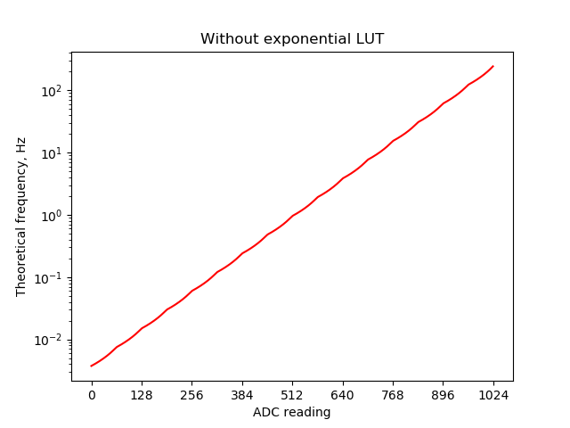

# LFO Remastering
Improved & bugfixed LFO firmware.
If you are looking for a refactored firmware that is most similar to the original, see the LFO_Refactoring folder instead.

Original code Original code by Vaclav Pelousek @ [Bastl Instruments](http://www.bastl-instruments.com) (c) 2017  

## Main changes
- Whole 10 bits of ADC resolution are used for frequency setup instead of just 8
- Rungler is properly randomized in initialization (made using EEPROM)
- curveMap is cut out, LFO response to the frequency modulation is pseudo-logariphmic
- Square output is now completely symmetric and clean
- LFO reset done in a separate PCINT0 ISR and can react to short pulses even at low LFO frequencies
- LFO max frequency is now faster and it can be used as a sub-oscillator, which opens a lot of audiorate modulation creative possibilities
- ISR frequency is now capped at 15kHz
- Frequency response to the ADC input is now closer to exponential
- Parameters are updated in loop(), not in ADC ISR, atomic locks added
- Moved "lastAnalogValues[i] != analogValues[i]" to lfo_set_frequency

## Files description
- LFO_Remaster.ino: main file, initializing and stuff, variables update in loop()
- lfo.h, lfo.cpp: LFO core, Timer 1 rendering interrupt
- adc.h, adc.cpp : ADC functions, ADC interrupt, parameters update
- settings.h: Settings defines

## Compiling
This code is intentded for Attiny85 running @ 8Mhz.

Compile options (with AttinyCore 1.3.3, Arduino IDE 1.8.10):
- Attiny85 @ 8MHz internal
- Millis/micros: disabled
- Timer1 clock: CPU
- LTO: Enabled
- B.O.D. : disabled
- Save EEPROM: EEPROM Retained

## Settings in settings.h

- __S_TRUE_RANDOM__ Trully randomizes the rungler byte every initialization
- __S_USE_8BIT__ Use only 8bits of ADC resolution
- __S_FASTER_LFO__ Increases the ADC conversion result for LFO frequency calculation by the amount set in this define. Requiered since the ADC for some reason does not read whole 0-1023 range. If you wish to return to the original frequnecy range, comment this define out (it's faster than setting it to 0)
- __S_USE_EXP_LOOKUP__ Makes the transition between timer1 prescalers exponential by using a look-up table (before audiorate cap)
- __S_PRESCALER_CAP__ At which prescaler value the program switches to audiorate mode. Do not set to a value lower than 1.
- __S_ISRFREQ_TEST__ Replaces the square output with a square output that indicates the Timer1 ISR frequency. Added only for debugging purposes.

## Known bugs & issues

- Probably not an issue at all: if you connect the square output to the LFO rate modulation and set the LFO rate modulation knob to max, a rising saw that is produced on the LFO Tri output clicks every period.

## TODO
- Find and fix bugs
- Add DUAL_STEP firmware capabilities in this one by utilizing defines
- Make LFO react to reset almost instantly by resetting all prescalers and calling the Timer1 ISR in the reset ISR
- It would be much better if INT0 ISR would be used instead of the PCINT0 ISR for reset, though it requires the schematic to be changed (PINB2 and PINB3 have to be swapped)
- Make the ADC frequency higher, maybe add running mean noise smooting and/or hysteresis

## Bad ideas
- Replacing lfo flopping by simply computing (255-lfoValue) with PWM inversion bit. This is a bad idea, because such a solution causes glitches due to a race condition between setting the OCR0B and COM0B0 (do we invert the PWM output first or set it to the right value first?)
- Making the EEPROM a bit more redundant (CRC checks and stuff). Totaly unnecessary.

## Theoretical LFO frequency explanation (or how lfo_set_frequency works)

Since this is way too complicated, I've decided to move the explanation here to remove all unnecessary comments from the code. First of all I should state that actual LFO frequency differs from the theoretical one due to CPU clock fluctuations and systematic errors due to finite code execution time.

The LFO frequency is controlled by 3 factors:
- Timer1 prescaler
- Timer1 OCR1A compare value
- LFO phase increase in each Timer1 ISR call

In the original code, the latter is omitted and is always set to 1 with uint8_t phase type. Here I've made the LFO phase 16-bit and by default the lfo phase increase is 0x100, and high 8 bits of lfo phase are used as output.

Firmware can work in 2 modes:
- Full 8 bit output resolution, LFO phase increase is fixed at 0x100, frequency is changed only by Timer1 prescaler and Timer1 compare value (before audiorate mode)
- Audiorate mode: Timer1 prescaler is capped at __S_PRESCALER_CAP__, Timer1 OCR1A is set to 0xFF, LFO frequency is controlled only by LFO phase increase, which is > 0x100.

LFO frequency approx. equals to: 8 MHz _(CPU clock)_ / 2^(Timer1 prescaler value - 1) / OCR1A / 256 _(lfo max value)_ / 2 _(because it is a triangle)_ / (256 / lfo_phase_increase).

#### Before audiorate
First, the ADC value is increased by the __S_FASTER_LFO__ value and capped at 1023. Then, if __S_USE_8BIT__ is set, low 2 bits of the ADC value are set to 0.

Essentially an 11-bit value is used to control the frequency. Since both Timer1 prescaler and Timer1 compare value decrease the frequency when increased, the 11-bit control value is inverted.
ADC is only 10-bit, so it has to be bitshifted to the left, therefore

> freq = 2047 - (freq << 1);

Attiny85 Timer1 supports 16 prescaler values 0-15, where 0 means "timer stopped" and should never be set in our case. 1 means "1/1 prescaler", and 15 means "1/16384" (max value). High 4 bits of the 11-bit value are used for the prescaler. Since the prescaler control is exponential, the frequency response to the ADC value becomes exponential as well (see the formula above).

Between Timer1 prescaler changes, lower 7 bits of _freq_ are used as a compare value. We can't use whole 8 bit resolution, since the compare value at the end of the same-prescaler range needs to be 2 times lower than it was in the beginning. Therefore, the OCR1A compare value can only change in the range 127-255, not 0-255 (lower than 127 it is easier to just change the prescaler).
Since Timer1 OCR1A period control is linear rather than exponential, a look-up table needs to be implemented to fix this issue. This is done by setting the __S_USE_EXP_LOOKUP__ define.

Below is the log-graph of the frequency dependence on the ADC value (OCR1A = freq & 0x7F + 0x80). Timer1 prescaler changes can be clearly seen.

The look-up table has to be 127 bytes long and satisfy three conditions:
- Be exponential;
- `f(0) = 128`;
- `f(127) = 255`.

Therefore,

> f(x) = 128 * 2 ^ (x / 127.721)

The 127.721 value is determined from the last condition. Fixed LFO frequency response is shown below.

Unfortunately, high Timer1 ISR frequencies are unreachable due to the ISR code being too long. Therefore, at a certain ISR frequency we should cap it and control the LFO frequency with lfo phase increase instead.

#### Audiorate mode

Firmware switches to the audiorate mode once the prescaler value becomes lower than __S_PRESCALER_CAP__. If the __S_PRESCALER_CAP__ is set to 2, the ISR frequency at which the switch occurs is approx. 15kHz. The ISR frequency does not change after that.

Again, the lfo phase increase controls the frequency non-exponentially, so a look-up table is requred yet again. Moreover, the lfo phase increase inversely controls the frequency (while Timer1 prescaler and Timer1 OCR1A decrease the LFO frequency when increased, lfo phase increase increases it). The inversion is actually done in the look-up table, but for simplicity I'll just forget about it for now.

The look-up table has to satisfy these conditions:
- Be exponential: f(0) = f(128) / 2 = f(256) / 4, etc.
- f(0) = 0x100
- A result of two previous conditions: f(128) = 0x1FF

So, at this moment it is easy to determine that `f(x) = 256 * 2^(x/128)`. But, to save memory, this function is simplfied (otherwise the LUT will be 16-bit and __S_PRESCALER_CAP__ * 128 * 2 bytes long).

Instead of making the LUT very long, we can make it only 127 bytes long by:
- Storing only the values from `f(0)` to `f(127)`;
- Storing the values `f(x) - 0x100` to make the LUT uint8_t type (all of the f(x) values are > 0x100)

Each prescaler change at the audiorate frequencies is then accompanied by multipliend the LUT table by 2. If we also remember about the inversion, the final LUT table is:

> f(x) = 256 * 2^((127 - x) / 128) at x in [0, 127]

#### Single-cpu cycle changes

Since there definetely will be conflicts if we set Timer1 prescaler, OCR1A value and lfo phase increase in several CPU cycles the code that actually writes these values needs to be as short as possible. Therefore, they are computed in variables _prescaler_, _compVal_, _lfo_inc_ and only in the end are set as close to each other as possible.

## License
__CC-BY-SA__ according to the original license.
